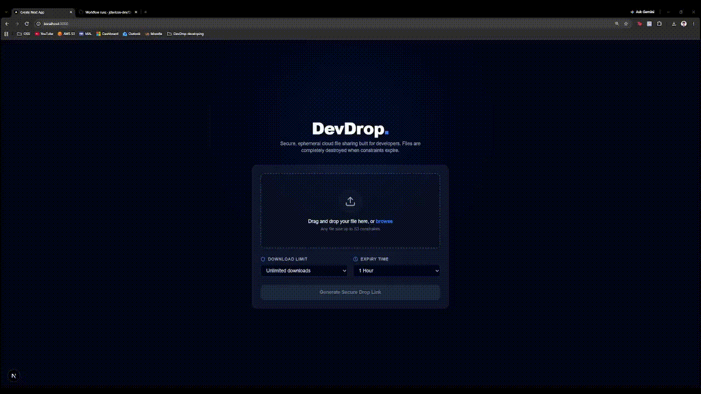

# DevDrop 💧
> **Ephemeral, zero-trust cloud file sharing for developers.**

  

## Key Features
* **Direct-to-S3 Presigned Streaming:** Bypasses backend server bottlenecks by uploading payloads straight to private AWS S3 buckets.
* **Enforced Single-Use Lifecycle:** MongoDB virtual getters validate download quotas and expiration constraints in real time.
* **Zero-Persistence Gatekeeping:** Restricts link access automatically after lifecycle consumption.